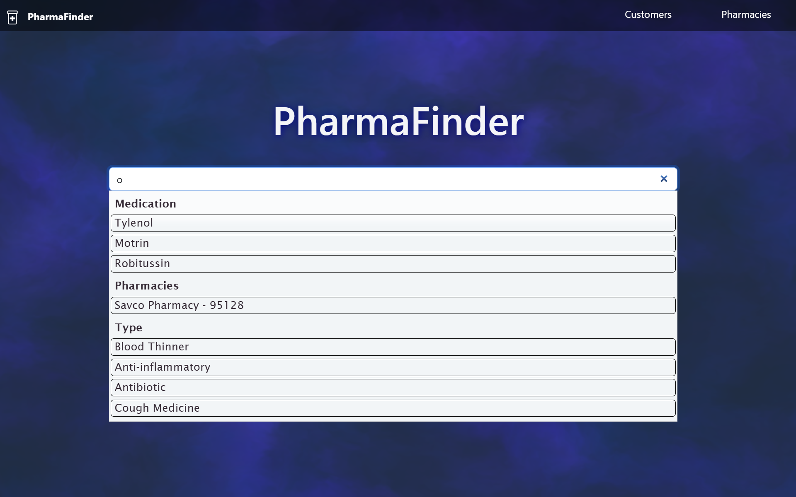

# PharmaFinder

**PharmaFinder** is a web application built using **JSP**, **Jakarta Servlets**, **MySQL**, and the **JDBC API** that helps customers quickly find the nearest pharmacy stocking their desired medication.



## Authors

* [**Talha Aziz**](https://github.com/taaziz1)
* [**Shreya Maipady**](https://github.com/maipadyshreya)
* [**Le Duy Nguyen**](https://github.com/LeDuyNg)

## Technologies Used

* **MySQL Community Server 8.0.42** – [Download](https://downloads.mysql.com/archives/community/)
* **MySQL Workbench 8.0.42** – [Download](https://downloads.mysql.com/archives/workbench/)
* **Apache Tomcat 11.0.9** (or later) – [Download](https://tomcat.apache.org)


* **MySQL JDBC Driver 8.0.33** – *Included as Maven Dependency*
* **Jakarta Servlet API 6.1.0** – *Included as Maven Dependency*
* **Jakarta JSP API 3.1** – *Included as Maven Dependency*
* **Google Maps API** – *API Key Required*

## Features

### **Search & Navigation**

* Any user can search by **medication name**, **medication type**, or **pharmacy name**
* Pharmacies display their **distance and travel time** from a desired location through the **Google Maps API**
  * In search results, pharmacies are **ordered** based on distance

### **Customer Features**

* **Account Registration** – Create a customer account with password complexity checks and required field validation
* **Change Avatar** – Choose from 10 preset avatars
* **Change Password** – Requires old password; enforces complexity rules and prevents reusing the current password
* **Delete Account** – Requires password verification; removes customer data, reviews, and account credentials from the system
* **Post Review** – Submit one review per pharmacy; review form disappears after posting
* **Edit Review** – Modify an existing review on a pharmacy page
* **Delete Review** – Removes the review from the system
* **View Posted Reviews** – See all reviews one has made in chronological order, with direct links to the corresponding pharmacy

### **Pharmacy Features**

* **Pharmacy Registration** – Register with business details, employer identification number, and store address
* **Manage Store Information** – Update store details with the same validation as registration; changes reflected in real time on website
* **Change Password** – Requires employer identification number and old password; enforces complexity rules and prevents reusing the current password
* **Delete Account** – Requires employer identification number and password; removes all associated data, including reviews and address records
* **Medication Management** – Add, edit, and delete medications in inventory

## Setup Instructions

1. **Clone the Repository**

```bash
git clone https://github.com/taaziz1/CS157A-team1.git
```

2. **Import the Database**

    * Open **MySQL Workbench 8.0.42** (or later)
    * Run the `pharmafinderdb.sql` script from the cloned repository 

3. **Import the Project into Your IDE**

    * Use **Eclipse for Enterprise Java and Web Developers**, **IntelliJ IDEA Ultimate Edition**, or any **Java IDE** with **Apache Tomcat** support
    * Select the top-level directory of the cloned repository to import as a **Maven project**

4. **Configure Tomcat**

    * Add **Apache Tomcat 11.0.9** (or later) as a server runtime environment in your IDE (if needed)
    * Add **Apache Tomcat** as a run configuration and choose the `src/main/webapp` subdirectory for deployment

5. **Set Up System Properties**

   * Create a `database.properties` file under the `/conf` subdirectory of your **Apache Tomcat** installation with the following properties:

```properties
user=<Your MySQL username>
pass=<Your MySQL password>
apiKey=<Google Maps API key>
```

6. **Run the Application**

    * Run the **Apache Tomcat** configuration
    * Open your browser and navigate to:

      ```
      http://localhost:8080/PharmaFinder/index.jsp
      ```
